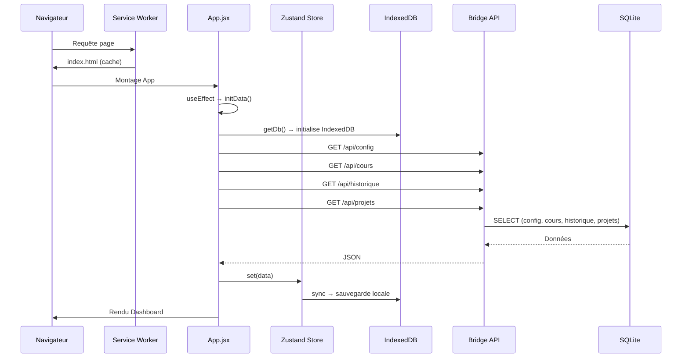
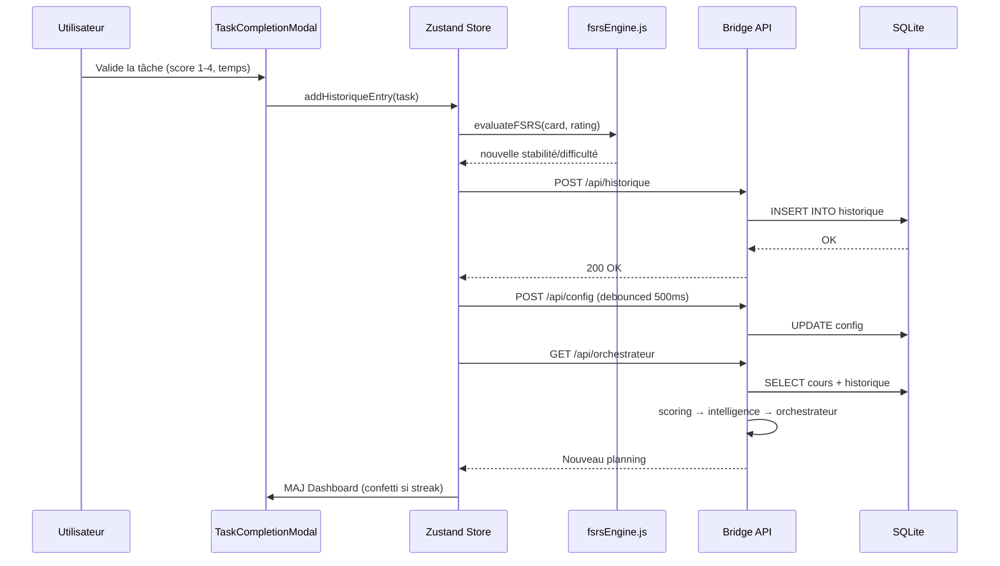
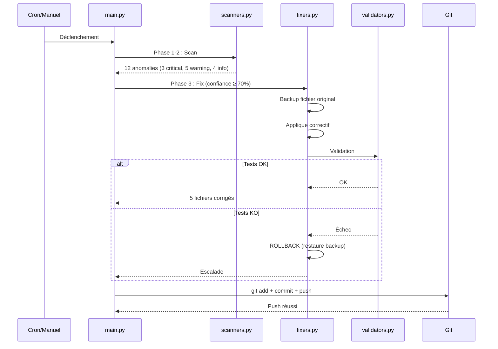

# Architecture ELPIS — Documentation Complète

> **Pour qui ?** Développeurs qui veulent comprendre comment ELPIS fonctionne de fond en comble.
> **Prérequis** : Avoir lu le [README.md](README.md) et le [guide débutant](docs/guide_debutant.md).
> **Dernière mise à jour** : 2026-07-21

---

## Table des matières

1. [Vue d'ensemble](#1-vue-densemble)
2. [Principes architecturaux](#2-principes-architecturaux)
3. [Couche Frontend (React + Vite + PWA)](#3-couche-frontend-react--vite--pwa)
4. [Couche Bridge (Express + SQLite)](#4-couche-bridge-express--sqlite)
5. [Couche Audit (Python)](#5-couche-audit-python)
6. [Couche Persistance (SQLite + JSON)](#6-couche-persistance-sqlite--json)
7. [Couche Infra (CI/CD + Déploiement)](#7-couche-infra-cicd--déploiement)
8. [Flux de données détaillés](#8-flux-de-données-détaillés)
9. [Sécurité](#9-sécurité)
10. [Résilience et robustesse](#10-résilience-et-robustesse)
11. [FAQ Architecture](#11-faq-architecture)

---

## 1. Vue d'ensemble

ELPIS est une **PWA full-stack offline-first** organisée en **Clean Architecture** à 5 couches.

```
┌──────────────────────────────────────────────────────────┐
│  📱 COUCHE 1 : FRONTEND (React 19 + Vite + PWA)         │
│  interface/web/src/  —  82 fichiers JSX, 154 JS          │
│  Pages, Composants, Zustand, RxDB, FSRS, Capacitor      │
│                                                          │
│  RÔLE : Interface utilisateur, état local, offline       │
├──────────────────────────────────────────────────────────┤
│  🌉 COUCHE 2 : BRIDGE (Express.js + SQLite)              │
│  interface/bridge/  —  server.js, 10 routes, 12 moteurs  │
│  REST API, Orchestrateur v3, Intelligence, RL Engine     │
│                                                          │
│  RÔLE : Logique métier, API, persistance                 │
├──────────────────────────────────────────────────────────┤
│  🛡️ COUCHE 3 : AUDIT (Python — Immune System v3.2)       │
│  agent_audit/  —  57 règles, 10 scanners, auto-fix       │
│  ESLint, Ruff, GitHub auto-commit, backup/rollback       │
│                                                          │
│  RÔLE : Qualité du code, détection de bugs, auto-fix     │
├──────────────────────────────────────────────────────────┤
│  🗄️ COUCHE 4 : PERSISTANCE (SQLite + JSON)              │
│  data/  —  elpis.sqlite, espoir_*.json, backups/        │
│  7 tables SQLite, WAL mode, écritures atomiques          │
│                                                          │
│  RÔLE : Stockage durable, résilience                     │
├──────────────────────────────────────────────────────────┤
│  📦 COUCHE 5 : INFRA (Config, CI/CD, Scripts)            │
│  render.yaml, .github/workflows/, scripts/, Dockerfile  │
│  Déploiement Render, CI GitHub Actions, Docker           │
│                                                          │
│  RÔLE : Build, déploiement, automatisation               │
└──────────────────────────────────────────────────────────┘
```

---

## 2. Principes architecturaux

### Clean Architecture — Séparation des responsabilités

```
Frontend ──(REST API)──> Bridge ──(SQL)──> SQLite
   │                        │
   │                        └──(spawn)──> Agent Audit (Python)
   │
   └──(IndexedDB)──> RxDB (stockage local navigateur)
```

Chaque couche :
- **Ne connaît que la couche en dessous** (le frontend ne sait pas que c'est du SQLite)
- **Est testable isolément** (11 fichiers de test backend, tests unitaires frontend)
- **Peut être remplacée** (le frontend pourrait passer de React à Vue sans toucher au backend)

### Offline-first

ELPIS fonctionne SANS connexion Internet grâce à 3 mécanismes :
1. **RxDB (IndexedDB)** dans le navigateur — stocke config, cours, historique, projets
2. **Service Worker PWA** — intercepte les requêtes, sert le cache si hors-ligne
3. **API Bridge locale** — tourne sur `localhost:3001`, toujours accessible

Quand la connexion revient, RxDB synchronise automatiquement les modifications locales vers le bridge.

### Architecture décisionnelle

Le flux de décision est centralisé dans l'**Orchestrateur** :

```
Données brutes (cours, config, historique)
        │
        ▼
    Scoring (scoring.js)     ← priorise par urgence + ECTS
        │
        ▼
    Intelligence (intelligence.js) ← burnout, vélocité, projections
        │
        ▼
    Orchestrateur (orchestrateur.js) ← assemble le planning final
        │
        ▼
    RL Engine (rlEngine.js)   ← ajuste via UCB Bandits
        │
        ▼
    Planning quotidien → renvoyé au Frontend
```

---

## 3. Couche Frontend (React + Vite + PWA)

### Arbre des composants

```
App.jsx (Racine — routing, thème, initData)
├── ErrorBoundary (capture les crashs React)
├── ToastProvider (notifications globales)
├── Sidebar.jsx (navigation)
├── GlobalSearchModal.jsx (Ctrl+K)
├── Repetiteur.jsx (Le Répétiteur — questions/réponses calculées sur les tables)
├── BackgroundMusicPlayer.jsx
├── GlobalChrono.jsx (chronomètre flottant PiP)
├── Dashboard.jsx (accueil) ── utilise ──┬── useTaskCompletion
│                                         ├── useDashboardStats
│                                         ├── useWorkloadEngine
│                                         └── components/dashboard/
├── EntrainementPage.jsx ── utilise ──┬── fsrsEngine.js
│                                      └── useTaskCompletion
├── CoursPage.jsx ── utilise ──┬── MatiereCard, ExerciceCard, etc.
│                               └── MarkdownModal
├── BulletinPage.jsx (notes, ECTS, compensation)
├── StatistiquesPage.jsx (Recharts, KPIs)
├── RevisionsAvanceesPage.jsx
├── ProjetsPage.jsx
├── PreparationHebdoPage.jsx
├── GraphPage.jsx (react-force-graph-3d)
├── ClassementPage.jsx
├── MesVideosPage.jsx
└── Config (intégrée dans App.jsx)
```

### State Management

```
┌──────────────────────────────────────────┐
│  Zustand Store (store.js)                │
│  ┌────────────────────────────────────┐  │
│  │ config       → sauvegardé auto     │  │
│  │ coursConfig  → RxDB + Bridge       │  │
│  │ historique   → RxDB + Bridge       │  │
│  │ projets      → RxDB + Bridge       │  │
│  │ orchestratorData                    │  │
│  │ intelligence                        │  │
│  └────────────────────────────────────┘  │
│  Middleware : Immer (immutabilité)       │
│  Debounce : 500ms avant sauvegarde       │
├──────────────────────────────────────────┤
│  ChronoStore (séparé, Zustand)          │
│  ┌────────────────────────────────────┐  │
│  │ isRunning, startTime, elapsed      │  │
│  │ Mode PiP, notifications            │  │
│  └────────────────────────────────────┘  │
├──────────────────────────────────────────┤
│  RxDB (IndexedDB via Dexie)             │
│  4 collections : config, cours,         │
│  historique, projets                    │
│  Sync bidirectionnelle avec Bridge      │
│  LeaderElection (conflits onglets)      │
└──────────────────────────────────────────┘
```

### Résilience réseau

```
Appel API
    │
    ▼
fetchWithRetry(url, options)
    ├── Tentative 1 → échec ? retry après 1s
    ├── Tentative 2 → échec ? retry après 2s
    ├── Tentative 3 → échec ? retry après 4s
    └── Échec final → fallback RxDB (données locales)
```

---

## 4. Couche Bridge (Express + SQLite)

### Routes API

```
server.js (Express, port 3001)
├── Middlewares :
│   ├── Helmet (CSP, XSS, clickjacking)
│   ├── CORS (localhost:5173 dev)
│   ├── Rate Limiting (500 req / 15 min)
│   └── Basic Auth (si ADMIN_PASSWORD)
│
├── Routes :
│   ├── /api/config          → config.js
│   ├── /api/cours           → cours.js
│   ├── /api/historique      → historique.js
│   ├── /api/orchestrateur   → orchestrateur.js (CACHE 60s LRU)
│   ├── /api/projets         → projets.js
│   ├── /api/anki            → anki.js (AnkiConnect localhost:8765)
│   ├── /api/chat            → chat.js (moteur/repetiteur — local)
│   ├── /api/music           → music.js
│   ├── /api/system          → system.js (audit, upload, shutdown)
│   └── /api/telemetry       → telemetry.js
│
└── Sert le build React (dossier dist/) en mode production
```

### Moteur métier — Le cerveau

```
orchestrateur.js (~800 lignes)
│
├── scoring.js (~300 lignes)
│   └── getPrioScore() = 1/√(pratiques+1) × 12 multiplicateurs
│       ├── Boost ECTS (poids des crédits)
│       ├── Boost Urgence (proximité examen)
│       ├── Boost Découverte (matières jamais vues ×2)
│       ├── Boost Inactivité (non révisé depuis 7j ×3)
│       ├── Boost Examen imminent (J-3 ×5)
│       ├── Fuzzy matching noms examens
│       └── Exclusion UEs acquises (ue.acquise = true)
│
├── intelligence.js (~600 lignes) — 12 "cartes d'intelligence"
│   ├── Carte 1  : Compensation UE
│   ├── Carte 2  : Vélocité (EMA par matière)
│   ├── Carte 3  : Détection Burnout (7 jours)
│   ├── Carte 4  : Projections notes (régression linéaire + IC 95%)
│   ├── Carte 5  : Synergie Jaccard (chevauchement concepts ≥ 40%)
│   ├── Carte 6  : Workload Forecast (Holt-Winters)
│   ├── Carte 7  : Charge Cognitive (K-Means 1D, 3 clusters)
│   ├── Carte 8  : Optimisation Chronotype
│   ├── Carte 9  : Détection Matières Orphelines
│   ├── Carte 10 : Analyse Temps d'Étude
│   ├── Carte 11 : Progression Globale
│   └── Carte 12 : Recommandation Hebdomadaire
│
├── rlEngine.js (~100 lignes)
│   └── UCB Bandits : Q + C×√(ln(N)/n)
│
└── ankiSync.js (~150 lignes)
    └── AnkiConnect (localhost:8765), cache 5min, batching 5
```

### Base de données SQLite

```
elpis.sqlite (WAL mode, better-sqlite3)
│
├── Table licences     (id, nom)
├── Table semestres    (id, licence_id, numero)
├── Table ues          (id, semestre_id, nom, code, ects, acquise, dispense)
├── Table matieres     (id, ue_id, nom, coeff_cm, coeff_td, coeff_tp, annales)
├── Table cours_cm     (id, matiere_id, titre, examen_date, ...)
├── Table exercices    (id, matiere_id, type [TD/TP/ANNALE], titre, difficulte, ...)
├── Table historique   (id, matiere_id, action, score, temps, timestamp)
├── Table config       (key, value)
└── Table projets      (id, nom, phases, progression)
```

---

## 5. Couche Audit (Python)

### Cycle d'audit (10 phases)

```
Phase 1  : Collecte fichiers (exclut node_modules, .git, backups...)
Phase 2  : Scanners globaux (imports, layers, tests, NPM audit)
Phase 3  : Linters (ESLint, Ruff) avec backup/rollback
Phase 4  : Application règles fixables (confiance ≥ 70%)
Phase 5  : Validation post-fix (tests + syntaxe) → rollback si échec
Phase 6  : Escalade anomalies non-corrigibles
Phase 7  : Construction rapport JSON
Phase 8  : Health check (auto-diagnostic agent)
Phase 9  : Nettoyage backups (> 10 sessions)
Phase 10 : Auto-commit Git (si corrections) + push
```

### Stratégies de scan

| Stratégie | Description | Exemple de règle |
|-----------|------------|------------------|
| REGEX | Scan ligne par ligne avec regex | `NO_EVAL`, `NO_VAR` |
| IMPORT_GRAPH | Détection cycles d'imports | `NO_CIRCULAR_IMPORTS` |
| STRUCTURAL | Taille fonctions/fichiers, nesting | `EXCESSIVE_FUNCTION_LENGTH` |
| TEST_PAIRING | Fichier source sans test | `MISSING_TEST_FILE` |
| LAYER_BOUNDARY | Violation architecture | `LAYER_VIOLATION` |
| CUSTOM_PYTHON | Règles complexes (JS/React/Python) | `USEEFFECT_MISSING_CLEANUP` |

---

## 6. Couche Persistance (SQLite + JSON)

### Migration JSON → SQLite

```
data/espoir_*.json (legacy)
        │
        ▼
db/migrate.js  ── runMigration()
        │
        ├── Lit les JSON existants
        ├── Crée les tables SQLite
        ├── Insère les données
        └── Supprime les JSON (option safe keep)
        │
        ▼
data/elpis.sqlite (actif)
```

### Écriture atomique

```
1. Données à sauvegarder
       │
       ▼
2. Écriture dans .tmp/
       │
       ▼
3. fs.renameSync(.tmp → fichier final)  ← atomique (succès ou rien)
       │
       ├── Succès → fichier mis à jour
       └── Échec (partitions différentes) → fs.copyFileSync (fallback)
```

### Backups automatiques

- SQLite : backup quotidien dans `data/backups/`, 5 jours de rétention
- Agent audit : backup avant chaque correction, 10 sessions de rétention

---

## 7. Couche Infra (CI/CD + Déploiement)

### CI/CD Pipeline

```
Push / PR sur GitHub
        │
        ▼
.github/workflows/ci.yml
├── Checkout code
├── Install Node.js 20
├── npm install (bridge + web)
├── npm test (bridge)
├── npm test (web)
└── npm run build (web)
        │
        ▼
    ✅ Tous les tests passent → PR peut être mergée
    ❌ Un test échoue → blocage
```

### Audit Cloud (GitHub Actions Cron)

```
Toutes les heures (cron: 0 * * * *)
        │
        ▼
.github/workflows/agent_audit.yml
├── Checkout code
├── Install Python
├── python agent_audit/main.py --once
├── git add + commit (si corrections)
└── git push
```

### Déploiement Render.com

```
Push sur main
        │
        ▼
render.yaml
├── Build : npm install + npm run build
├── Start : node server.js
└── Port : 3000, Node 20, plan free
```

---

## 8. Flux de données détaillés

### Démarrage de l'application



### Validation d'une tâche (CM)



### Audit automatique



---

## 9. Sécurité

### Défense en profondeur

| Couche | Protection | Implémentation |
|--------|-----------|---------------|
| Réseau | Rate Limiting | 500 req / 15 min (Express) |
| HTTP | Helmet (CSP, XSS, HSTS) | `server.js` middleware |
| Authentification | Basic Auth (optionnelle) | `ADMIN_PASSWORD` env var |
| API | Validation Zod | Toutes les routes (schemas.js) |
| Fichiers | Path Traversal Protection | `/api/open/file` verrouillé |
| Base de données | Écritures atomiques | `fileUtils.js` atomicWriteFileSync |
| CI/CD | Secrets GitHub | `ADMIN_PASSWORD` — seul secret du projet |
| Audit | Scan continu | 57 règles, dont 8 de sécurité |

---

## 10. Résilience et robustesse

### Ce qui arrive quand...

| Scénario | Comportement ELPIS |
|----------|-------------------|
| **Coupure Internet** | RxDB prend le relais (données locales IndexedDB). Interface fonctionne normalement. |
| **Retour Internet** | RxDB sync bidirectionnelle automatique. Les données locales sont poussées vers le bridge. |
| **Crash serveur pendant sauvegarde** | Écriture atomique : le fichier `.tmp` n'est pas renommé, l'original reste intact. |
| **Corruption JSON** | Zod rejette les entrées invalides avec un message explicite. |
| **Fichier supprimé par erreur** | Backups SQLite quotidiens (5 jours). Agent audit garde 10 sessions. |
| **Bug React** | ErrorBoundary capture l'erreur, affiche un bouton "Recharger". |
| **Dépendance manquante** | `npm install` manquant → message d'erreur clair dans les logs. |
| **Port 3001 bloqué** | Détection + message explicatif dans les logs. |
| **Règle d'audit trop agressive** | Correction → validation échoue → ROLLBACK automatique. Backup du fichier original préservé. |

---

## 11. FAQ Architecture

### Pourquoi SQLite et pas MySQL/PostgreSQL ?
ELPIS est conçu pour être **100% local et portable**. Un fichier SQLite pèse quelques Mo, ne nécessite aucun serveur, et peut être copié/collé comme un document Word.

### Pourquoi RxDB en PLUS de SQLite ?
RxDB (IndexedDB) est le cache **côté navigateur** pour le mode hors-ligne. SQLite est la base **côté serveur** pour la persistance durable. Les deux sont nécessaires pour le offline-first : RxDB quand tu es dans le métro, SQLite quand tu rentres chez toi.

### Pourquoi deux moteurs FSRS (frontend ET backend) ?
- **Frontend** (`fsrsEngine.js`) : calcul immédiat de la nouvelle stabilité/difficulté après validation d'une tâche. Pas besoin d'appel API.
- **Backend** (`scoring.js`) : calcul global de priorité pour l'ordonnancement. Intègre les ECTS, l'urgence examens, etc.

### Pourquoi l'agent d'audit est en Python et pas en Node.js ?
L'écosystème Python excelle pour l'analyse statique de code (AST, regex complexes, Ruff). Le reste du projet est en JavaScript pour la cohérence full-stack. Les deux communiquent via `spawn` et fichiers JSON.

### Comment ELPIS scale-t-il ?
ELPIS est conçu pour un usage personnel ou petite équipe. Pas de scaling horizontal prévu. SQLite supporte des millions de lignes sans problème pour cet usage.

### Pourquoi pas TypeScript partout ?
ELPIS utilise JSDoc pour le typage — ça donne l'autocomplétion et la vérification de types sans étape de compilation supplémentaire. Le `tsconfig.json` est présent pour l'éditeur.

---

> **Mainteneurs** : Ce document décrit l'architecture **cible**. Si la réalité diverge, mettez à jour le document — ne laissez pas la doc devenir obsolète.
