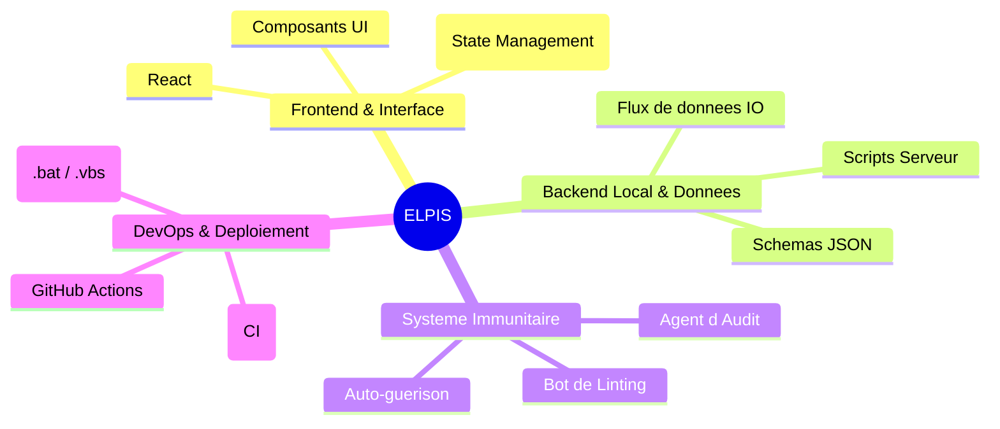

# Architecture Globale du Projet ELPIS

Voici une Mind Map représentant les grandes composantes du projet ELPIS telles qu'elles existent actuellement. L'objectif est de te donner une vue d'ensemble (la *Big Picture*) pour que tu puisses comprendre les différentes briques logicielles et choisir par où commencer ton apprentissage de zéro.

> [!TIP]
> **Conseil de Tuteur** : Quand on s'attaque à un projet "colossal", le secret est de le découper en petits morceaux gérables. 
> Généralement, on commence soit par la base de données/le backend (pour structurer les informations), soit par une interface basique (pour visualiser rapidement ce qu'on fait).
