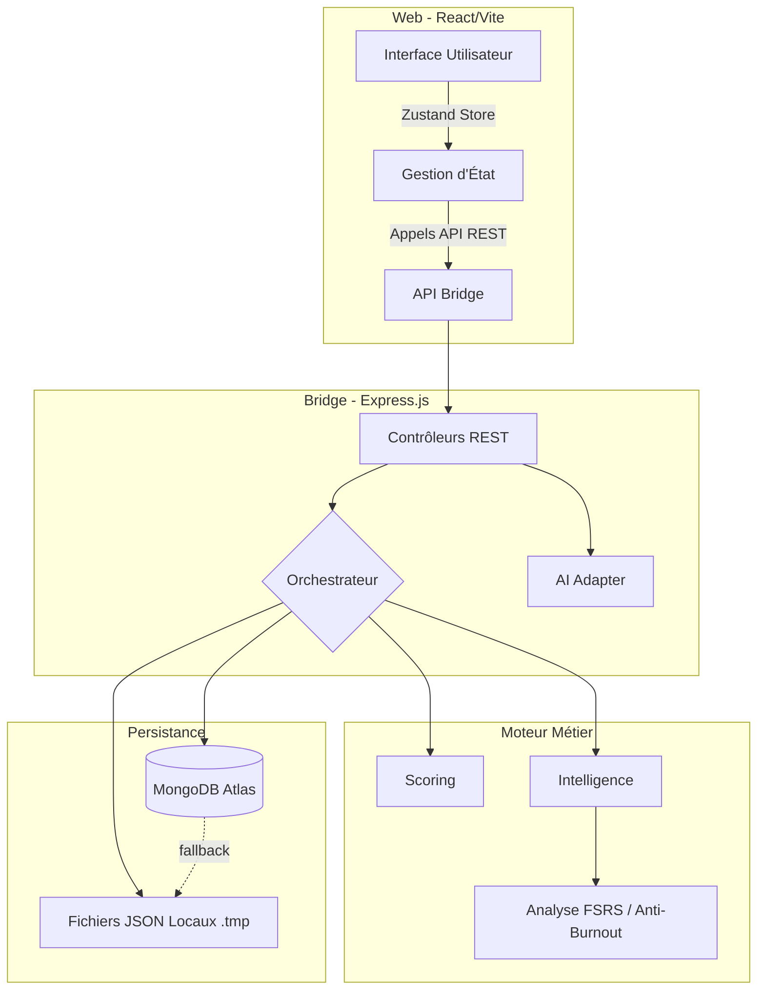

# ELPIS - Assistant d’étude intelligent

ELPIS est un assistant personnel intelligent conçu pour optimiser l'apprentissage et les révisions universitaires. Il repose sur un algorithme d'ordonnancement multi-critères (FSRS + Intelligence Pédagogique) pour générer des plannings quotidiens adaptés à la fatigue, l'urgence des examens, et la charge cognitive de l'étudiant.

---

## 🚀 Guide Rapide (Pour commencer)

Si tu veux simplement utiliser le projet :

1. Ouvre le dossier du projet sur Windows.
2. Double-clique sur [start_elpis.bat](start_elpis.bat) pour lancer ELPIS.
3. Ouvre ton navigateur sur `http://localhost:3001`.

**Si tu veux comprendre le projet sans te perdre, commence par [docs/guide_debutant.md](docs/guide_debutant.md).**

### La structure du projet en une phrase :
- [interface/web](interface/web) : l’interface que tu vois dans le navigateur.
- [interface/bridge](interface/bridge) : le cœur du serveur et de la logique métier.
- [data](data) : les fichiers locaux où sont stockées tes données.
- [docs](docs) : la documentation du projet.
- [agent_audit](agent_audit) : un outil automatique pour surveiller la qualité du code.

### Si quelque chose ne fonctionne pas :
- Vérifie que Node.js et Python sont installés.
- Vérifie que le port `3001` est libre.
- Relis les messages affichés dans le terminal (voir le guide débutant pour les décoder).
- Consulte [docs/guide_debutant.md](docs/guide_debutant.md) pour la procédure de dépannage.

---

## 🏗️ Architecture du Système

Le projet est divisé en 3 couches distinctes (Clean Architecture approach) :

### Flux de Données (Data Flow)

1. **Chargement** : Le frontend interroge le backend (`/api/cours`, `/api/config`, `/api/historique`). Le backend lit MongoDB (ou les fichiers locaux) et renvoie les données.
2. **Génération du Rapport** : Le frontend demande `/api/orchestrateur`. L'orchestrateur charge les données, calcule le **Boost Examen** via `scoring.js`, filtre via l'**Anti-Burnout** (`intelligence.js`), trie les candidats, et répartit l'effort (Matin/Après-midi/Soir). Le rapport est mis en cache (60s).
3. **Mise à Jour Atomique** : Une validation de tâche envoie un POST au bridge. L'écriture est **atomique** (écriture sur `.tmp`, puis `fs.renameSync` avec `fs.copyFileSync` en fallback) pour éviter toute corruption.

---

## 📡 API Reference (Bridge)

Le backend (Express.js) expose les routes suivantes sur le port `3001`.
*Note : Si la variable `ADMIN_PASSWORD` est définie, toutes les routes nécessitent une Basic Auth (user: `admin`).*

| Méthode | Endpoint | Description |
|---------|----------|-------------|
| GET     | `/api/config` | Récupère la configuration (profil, contraintes). |
| POST    | `/api/config` | Sauvegarde la configuration. |
| GET     | `/api/cours` | Récupère l'arbre entier des cours (Licences > Semestres > UE > CM/TD). |
| POST    | `/api/cours` | Sauvegarde l'arbre des cours. |
| GET     | `/api/historique` | Récupère l'historique d'étude complet. |
| POST    | `/api/historique` | Sauvegarde l'historique. |
| GET     | `/api/orchestrateur` | Génère ou renvoie le rapport quotidien mis en cache. |
| POST    | `/api/orchestrateur/force-task`| Génère une tâche forcée pour un CM/TD spécifique. |
| POST    | `/api/chat` | Discute avec l'IA (DeepSeek). |
| GET     | `/api/audit` | Récupère le dernier rapport de l'Agent d'Audit Python. |

---

## 🔒 Sécurité et Mises en Garde

- **Basic Auth** : En production (Render, Heroku, etc.), définir la variable `ADMIN_PASSWORD` activera l'authentification HTTP Basic.
- **Path Traversal** : L'accès aux fichiers locaux (via `/api/open/file`) est verrouillé au répertoire autorisé et complètement désactivé en mode production.
- **CSP & CORS** : Le backend est protégé par Helmet avec des directives CSP strictes.

---

## 🛠️ Déploiement & Environnement

Le projet est configuré pour être déployé sur des plateformes PaaS comme [Render](https://render.com) grâce au fichier `render.yaml` à la racine.

Variables d'environnement nécessaires en production (fichier `.env`) :
- `MONGODB_URI` : URI de connexion MongoDB Atlas (Ex: `mongodb+srv://...`). Optionnel si l'on veut rester 100% en local.
- `DEEPSEEK_API_KEY` : Clé API pour le coach IA.
- `ADMIN_PASSWORD` : Mot de passe pour bloquer l'accès à l'interface (sécurité production).

---

## 🛡️ Agent d'Audit Autonome (Python)

ELPIS intègre un **agent d'audit de code** écrit en Python qui tourne en arrière-plan et scanne automatiquement le code source toutes les heures.

- **Fonctionnement** : Scanne les fichiers JS/React pour détecter des anomalies (URLs en dur, bugs de hooks, doublons dans la DB JSON).
- **Auto-Correction** : Le "Système Immunitaire" peut corriger les fichiers et les push automatiquement s'il est confiant.
- **Configuration** : Les règles sont définies dans `agent_audit/rules.json`.

📚 [Voir la documentation de l'agent](agent_audit/README.md)

---

## 📚 Pour aller plus loin (Documentation détaillée)

Si vous souhaitez plonger dans les entrailles du projet, lisez dans cet ordre :
1. [docs/backend.md](docs/backend.md) : Compréhension de l’API, de la logique d'intelligence et de l'orchestrateur.
2. [docs/frontend.md](docs/frontend.md) : Compréhension de l’interface React, de Zustand et du cache de la PWA.
3. [agent_audit/README.md](agent_audit/README.md) : Fonctionnement de l’outil d’audit automatique et de l'architecture "Système Immunitaire".
