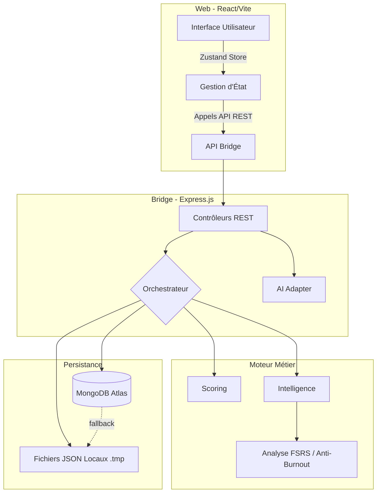

# ELPIS - Assistant d'Étude Intelligent

ELPIS est un assistant personnel intelligent conçu pour optimiser l'apprentissage et les révisions universitaires. Il repose sur un algorithme d'ordonnancement multi-critères (FSRS + Intelligence Pédagogique) pour générer des plannings quotidiens adaptés à la fatigue, l'urgence des examens, et la charge cognitive de l'étudiant.

## 🚀 Fonctionnalités Principales

- **Moteur FSRS** : Répétition espacée algorithmique.
- **Ordonnancement Intelligent** : 10 axes de priorité (Urgence examen, Anti-Burnout, Compensation inter-UE, Interleaving, etc.).
- **Génération de Planning (Rapport Quotidien)** : Sélection dynamique des tâches (CM, TD, TP, Annales) avec mode "fill-gap" et chronobiologie (Matin, Aprèm, Soir).
- **Coach IA (DeepSeek)** : Intégration conversationnelle injectée avec le contexte étudiant.
- **Double Persistance** : Mode Cloud (MongoDB) avec fallback Automatique Local (Fichiers JSON).
- **Sécurité** : Basic Auth (mode Cloud), Rate Limiting, Protection Path Traversal, CSP, Mode Night Owl, Écritures Atomiques.
- **Outils Intégrés** : Lecteur musical (calm/motivational), lecteur/scanneur de PDF (extraction d'exercices).

---

## 🏗️ Architecture du Système

Le projet est divisé en 3 couches distinctes (Clean Architecture approach) :



### Flux de Données (Data Flow)

1. **Chargement** : Le frontend interroge le backend (`/api/cours`, `/api/config`, `/api/historique`). Le backend lit MongoDB (ou les fichiers locaux) et renvoie les données.
2. **Génération du Rapport** : Le frontend demande `/api/orchestrateur`. L'orchestrateur charge les données, calcule le **Boost Examen** via `scoring.js`, filtre via l'**Anti-Burnout** (`intelligence.js`), trie les candidats, et répartit l'effort (Matin/Après-midi/Soir). Le rapport est mis en cache (60s).
3. **Mise à Jour** : Une validation de tâche envoie un POST au bridge. L'écriture est **atomique** (écriture sur `.tmp`, puis `fs.renameSync` protégé avec `fs.copyFileSync` en fallback) pour éviter toute corruption. La synchronisation MongoDB est déclenchée en asynchrone (debounced).

---

## 📡 API Reference (Bridge)

Le backend (Express.js) expose les routes suivantes sur le port `3001`.
*Note : Si la variable `ADMIN_PASSWORD` est définie, toutes les routes nécessitent une Basic Auth (user: `admin`).*

| Méthode | Endpoint | Description |
|---------|----------|-------------|
| GET     | `/api/config` | Récupère la configuration (profil, contraintes). |
| POST    | `/api/config` | Sauvegarde la configuration. |
| GET     | `/api/cours` | Récupère l'arbre entier des cours (Licences > Semestres > UE > CM/TD). |
| POST    | `/api/cours` | Sauvegarde l'arbre des cours. |
| GET     | `/api/historique` | Récupère l'historique d'étude complet. |
| POST    | `/api/historique` | Sauvegarde l'historique. |
| GET     | `/api/orchestrateur` | Génère ou renvoie le rapport quotidien mis en cache. Accepte `?extraTime=...&fillGap=...` |
| POST    | `/api/orchestrateur/specific-task`| Génère une tâche forcée pour un CM/TD spécifique. |
| POST    | `/api/chat` | Discute avec l'IA (DeepSeek). Le contexte utilisateur est injecté automatiquement. |
| POST    | `/api/pdf/scan` | (Multipart) Upload un PDF, extrait le texte et suggère des exercices détectés. |
| POST    | `/api/music/upload` | (Multipart) Ajoute une piste audio (`audio/*`). |
| POST    | `/api/open/file` | Ouvre un fichier local sur l'OS (Désactivé en production). |
| GET     | `/api/audit` | Récupère le dernier rapport de l'Agent d'Audit Python (santé du code). |

---

## 🔒 Sécurité et Mises en Garde

- **Basic Auth** : En production (Render, Heroku, etc.), définir la variable `ADMIN_PASSWORD` activera l'authentification HTTP Basic.
- **Path Traversal** : L'accès aux fichiers locaux (via `/api/open/file`) est verrouillé au répertoire `DOCUMENTS_DIR` et complètement désactivé en mode production.
- **CSP & CORS** : Le backend est protégé par Helmet avec des directives CSP strictes.

---

## 🛠️ Déploiement

Le projet est configuré pour être déployé sur des plateformes PaaS comme [Render](https://render.com) grâce au fichier `render.yaml` à la racine.

Variables d'environnement nécessaires en production :
- `MONGODB_URI` : URI de connexion MongoDB Atlas.
- `DEEPSEEK_API_KEY` : Clé API pour le coach IA.
- `ADMIN_PASSWORD` : Mot de passe pour bloquer l'accès à l'interface.

---

## 🛡️ Agent d'Audit Autonome (Python)

ELPIS intègre un **agent d'audit de code** écrit en Python qui tourne en arrière-plan et scanne automatiquement le code source toutes les 4 heures.

- **Fonctionnement** : Analyse par Regex de chaque fichier `.js` / `.jsx` pour détecter les non-conformités (URLs en dur, `console.log` oubliés, styles inline, etc.).
- **Configuration** : Les règles sont définies dans `agent_audit/rules.json` (modifiable sans toucher au code Python).
- **Résultats** : Sauvegardés dans `data/espoir_audit.json` et consultables via le bouton **🛡️ Code Health** sur le tableau de bord.
- **Lancement** : Automatique au démarrage du serveur, ou manuel avec `python agent_audit/main.py --once`.

📚 Pour la documentation complète (ajout de règles, configuration, format du rapport), voir [`agent_audit/README.md`](agent_audit/README.md).

---

## 📁 Arborescence du Projet

```
ELPIS/
├── agent_audit/           # Agent Python d'audit autonome
│   ├── main.py            # Script principal (boucle 4h)
│   ├── rules.json         # Règles d'audit modifiables
│   └── README.md          # Documentation de l'agent
├── backups/               # Backups automatiques (5 jours glissants)
├── data/                  # Données persistantes (JSON)
│   ├── espoir_config.json # Configuration utilisateur
│   ├── espoir_cours.json  # Arbre des cours
│   ├── espoir_historique.json # Historique d'étude
│   └── espoir_audit.json  # Rapport d'audit (généré automatiquement)
├── documents/             # PDFs et fiches stockées
├── interface/
│   ├── bridge/            # Backend Express.js (API REST)
│   │   ├── server.js      # Serveur principal
│   │   ├── moteur/        # Logique métier (orchestrateur, scoring, intelligence)
│   │   ├── mongoAdapter.js # Adaptateur MongoDB (Cloud ↔ Local)
│   │   └── aiAdapter.js   # Adaptateur IA (DeepSeek)
│   └── web/               # Frontend React/Vite
│       ├── src/           # Code source React
│       │   ├── components/# Composants réutilisables
│       │   ├── store.js   # État global (Zustand)
│       │   └── *.jsx      # Pages (Dashboard, Cours, Stats...)
│       └── dist/          # Build de production
├── music/                 # Fichiers audio (calm/motivational)
├── scripts/               # Scripts utilitaires
├── start_elpis.bat        # Lanceur Windows (CMD)
├── Lancer ELPIS.vbs       # Lanceur Windows (Double-clic)
└── README.md              # Ce fichier
```
