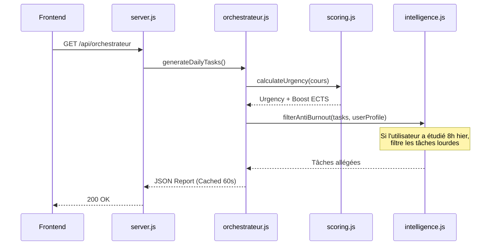

# Documentation Backend & Data

Le backend d'ELPIS est délibérément léger (Serverless / Fichiers statiques ou API Node.js locale) avec une persistance basée sur des fichiers JSON locaux. Cette architecture garantit la portabilité et permet au système de tourner sans base de données lourde.

## 🚀 Version simple pour débuter

Si vous débutez, pensez à ces trois idées :
- **Le backend** est le moteur qui sert les données à l’interface et calcule les statistiques.
- **Les fichiers JSON** dans [data/](../data) sont la mémoire du projet (pas besoin de configurer MySQL ou PostgreSQL).
- **Le serveur principal** est [interface/bridge/server.js](../interface/bridge/server.js).

---

## 1. Schémas de Données (Data Store JSON)

La persistance repose principalement sur le dossier `data/` à la racine du projet. L'écriture dans ces fichiers est effectuée de manière **atomique** par le backend pour éviter toute corruption de données.

### `espoir_config.json`
Stocke les réglages de l'application (préférences utilisateur, profil d'étudiant, configuration de l'intelligence).
```json
{
  "profil": {
    "fatigueChronique": false,
    "chronobiologie": "morning_lark"
  },
  "deepseek": {
    "model": "deepseek-chat"
  }
}
```

### `espoir_historique.json`
Consigne les résultats d'entraînement, le temps passé et les scores. C'est sur ce fichier que se base l'intelligence pour déterminer si un sujet est maîtrisé.
```json
[
  {
    "type": "TD",
    "titre": "Algèbre Linéaire",
    "matiere": "Mathématiques",
    "action": "Terminé",
    "timestamp": "2026-07-06T14:30:00Z"
  }
]
```

### `espoir_cours.json`
L'arbre de connaissances du système (Licences > Semestres > UE > Matières > CM/TD). Il inclut le nombre de crédits ECTS et les poids relatifs.

---

## 2. Le Moteur Métier (Core)

Le "Bridge" (Backend Express) ne fait pas que servir des fichiers, il contient le moteur intelligent d'ELPIS situé dans `interface/bridge/moteur/`.

### Cycle de vie d'une requête Orchestrateur

L'orchestrateur est la pièce maîtresse d'ELPIS : il génère le plan d'étude quotidien.



### Explication des Modules
- **`scoring.js`** : Calcule le "Boost Examen" et l'urgence de chaque matière. Plus la date de l'examen approche, plus le score de la tâche augmente. Les matières avec de gros coefficients ECTS sont priorisées.
- **`intelligence.js`** : Applique le filtre Anti-Burnout. Il lit `espoir_historique.json` et adapte la quantité de travail suggérée en fonction des jours précédents et du paramètre "fatigue chronique" du profil.
- **`fsrsEngine.js`** *(Frontend/Backend)* : Moteur de répétition espacée (Free Spaced Repetition Scheduler) pour planifier la date optimale de révision d'un concept.

---

## 3. Écritures Atomiques et Sécurité

Pour éviter de corrompre les JSON si le serveur crash pendant une sauvegarde :
1. Les données sont d'abord écrites dans un fichier temporaire (ex: `.tmp`).
2. Le backend effectue un `fs.renameSync` pour écraser l'ancien JSON. Sous Windows/Linux, cette opération de renommage est atomique.
3. Un fallback avec `fs.copyFileSync` est prévu au cas où les fichiers sont sur des partitions différentes.

---

## 4. Gestion des Fichiers Médias
- **Dossier `music/`** : Contient les pistes audio (ambiance lofi / binaural beats).
- **Dossier `documents/`** : Contient les PDFs générés ou uploadés par l'utilisateur (ignorés par Git pour des questions de poids). Le serveur expose ces répertoires en mode statique sécurisé (Protection contre le Path Traversal).
