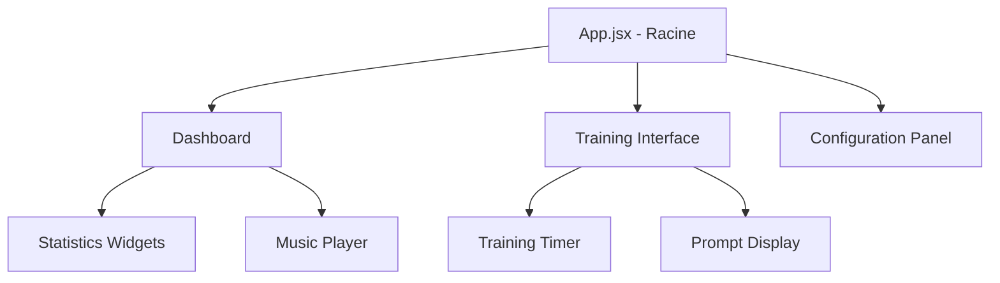

# Documentation Frontend (React)

Cette documentation détaille l'architecture de la couche de présentation de l'application ELPIS.

## 1. Arborescence et Composants Principaux

L'interface utilisateur est bâtie avec React (souvent via Vite). Le cœur de l'application réside dans le dossier `interface/`.

### Diagramme de Composants

### Principaux Fichiers
- **`App.jsx`** : Le point d'entrée qui orchestre le routing basique ou l'affichage conditionnel entre le tableau de bord et les sessions d'entraînement.
- **`Dashboard`** *(Note: composant volumineux sous surveillance)* : Affiche les métriques clés, les graphiques de progression et les contrôles principaux.
- **`Music Player`** : Gère la lecture des fichiers audio de fond (situés dans `music/`) via l'API Web Audio ou des balises HTML5, garantissant un environnement de concentration.

## 2. Gestion de l'État (State Management)

L'état de l'application est géré localement (Hooks React comme `useState`, `useEffect`, `useReducer`) ou potentiellement couplé avec le stockage JSON du backend.

**Flux de données typique (Unidirectional Data Flow)** :
1. Le composant demande les données au backend (ex: `espoir_historique.json`).
2. Les données sont stockées dans l'état du composant parent (`App.jsx` ou `Dashboard`).
3. Les données sont passées aux composants enfants via les *Props*.
4. Les actions utilisateurs déclenchent des callbacks qui mettent à jour l'état et envoient les requêtes de sauvegarde au backend.

## 3. Style et UI/UX

- L'interface privilégie une approche dynamique et réactive.
- Les dépendances CSS sont gérées localement ou via des modules CSS.
- **Règle stricte** : Pas de styles *inline* (surveillé et escaladé par l'Agent d'Audit).

## 4. Recommandations de Refactoring
Pour les contributeurs futurs : le `Dashboard` dépasse la limite d'alerte architecturale (> 500 lignes). Toute nouvelle feature UI complexe doit être extraite dans un composant enfant (dans un dossier `components/`) plutôt qu'ajoutée au fichier principal.
