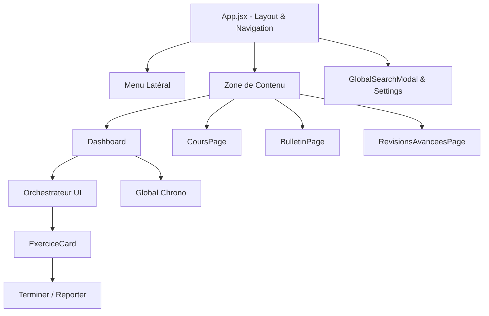

# Documentation Frontend (React & PWA)

Cette documentation détaille l'architecture de la couche de présentation de l'application ELPIS, conçue avec React et Vite.

## 1. Arborescence et Composants Principaux

L'interface utilisateur est bâtie pour être rapide, réactive et fonctionner hors-ligne (PWA).

### Diagramme de Composants



### Principaux Fichiers
- **`App.jsx`** : Le point d'entrée qui gère le routing (`wouter`), les modales globales et l'initialisation des thèmes.
- **`Dashboard.jsx`** : Affiche les métriques clés, la barre de streak, et consomme le rapport généré par l'orchestrateur pour afficher les tâches du jour.
- **`components/GlobalChrono.jsx`** : Composant crucial qui flotte sur l'écran pour minuter les sessions d'études. Son état est séparé pour éviter les re-rendus.
- **`store.js`** : Le cerveau de l'application côté client (Zustand).

---

## 2. Gestion de l'État (Zustand Store)

ELPIS utilise **Zustand** pour gérer l'état global, ce qui évite le "prop-drilling" et améliore considérablement les performances par rapport au Context API.

### Structure du Store (`useStore`)
Le store principal est défini dans `src/store.js` et gère les appels API synchronisés.

```javascript
// Données globales mises en cache
cours: [],          // Arbre de connaissances
config: {},         // Préférences (thème, chronobiologie)
historique: [],     // Logs d'études

// Actions synchronisées
fetchCours: async () => { ... } // Appelle /api/cours
addHistoriqueEntry: async (entry) => { 
  // 1. Mise à jour optimiste du store (UI rapide)
  // 2. Appel POST /api/historique (Backend)
}
```

### Le `useChronoStore` (Séparation des préoccupations)
Une règle d'architecture critique dans ELPIS est d'isoler les états à haute fréquence. Le `GlobalChrono` utilise son propre store pour que chaque seconde écoulée ne redessine pas toute l'application.

---

## 3. Stratégie PWA (Progressive Web App)

ELPIS est une PWA, ce qui permet à l'étudiant de l'installer sur son bureau (Chrome/Edge) ou son téléphone et de la lancer sans connexion internet.

### Configuration (`vite.config.js`)
L'application utilise `vite-plugin-pwa` avec **Workbox**.

- **Network-First pour l'`index.html`** : C'est une règle vitale (voir `AGENTS.md`). L'application cherche toujours à récupérer la dernière version du build React sur le réseau. Si le réseau échoue, elle fallback sur le cache. Cela prévient le fameux bug de "l'écran blanc" où un vieux `index.html` mis en cache demande des bundles JS `.hash.js` qui ont été supprimés du serveur après une mise à jour.
- **navigateFallbackDenylist** : Les requêtes commençant par `/api/` ou `/documents/` sont bloquées par le Service Worker. Sans cela, le SW intercepterait l'ouverture d'un PDF dans un nouvel onglet et renverrait l'application React à la place.

---

## 4. Style et UI/UX

- L'interface privilégie une approche dynamique et réactive.
- Le design system (géré dans `index.css`) utilise un système de tokens pour gérer le "Light Mode" (Morning/Afternoon) et le "Dark Mode" (Night Owl) dynamiquement selon l'heure.
- L'utilisation de bibliothèques tierces de UI est minimale pour préserver le contrôle total des micro-animations.

---

## 5. Recommandations de Développement

1. **Prévenir la Double Soumission** : Lors de la validation d'une tâche (ex: clic sur "Terminer"), utilisez toujours un verrou (`useRef` ou désactivation temporaire) pour empêcher un utilisateur impatient de créer des doublons dans `espoir_historique.json`.
2. **Feedback Visuel** : Toute action importante (ajout d'une matière, validation d'une tâche) doit utiliser le système de `Toast` intégré (`toast.success()`) pour rassurer l'utilisateur.
3. **Tests** : Chaque nouveau composant critique doit être accompagné de ses tests unitaires/intégration (`*.test.jsx`) avec Vitest.
