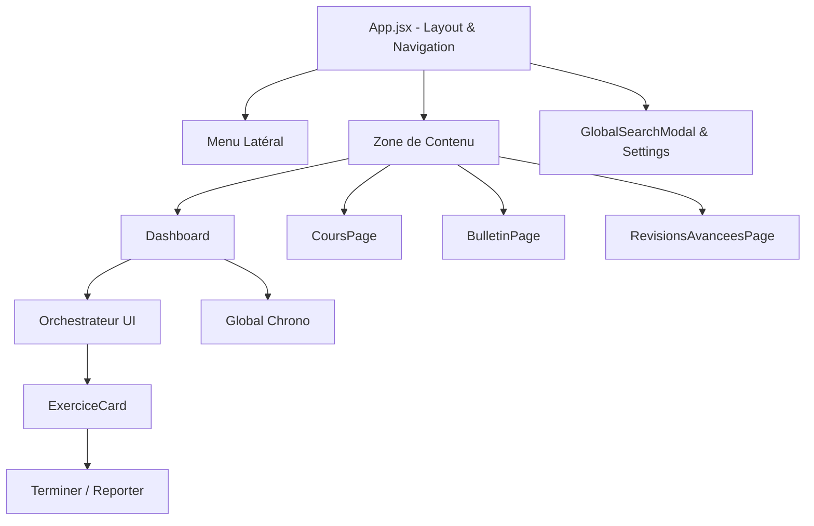
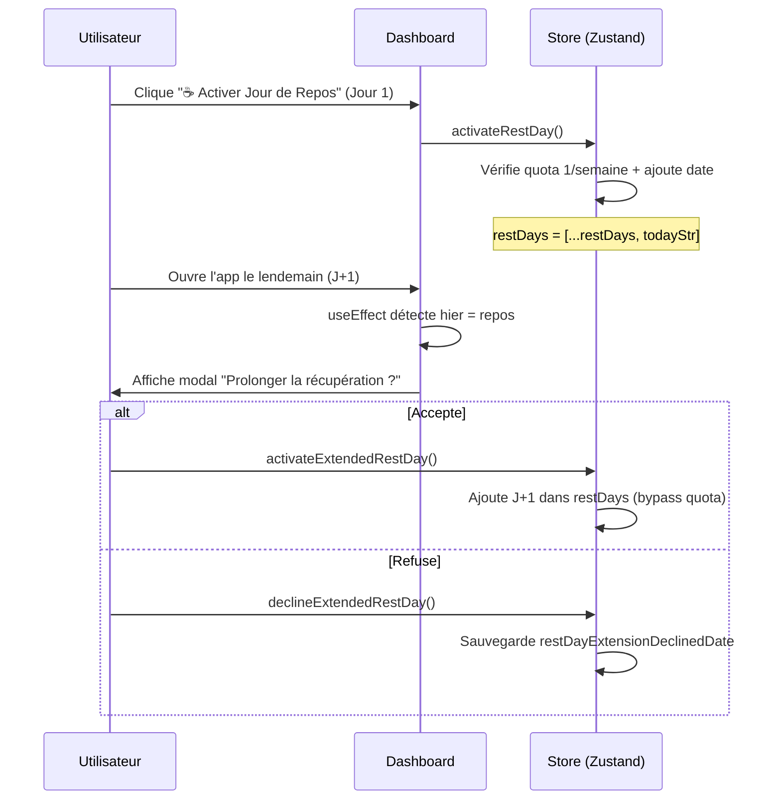

# Documentation Frontend (React & PWA)

Cette documentation détaille l'architecture de la couche de présentation de l'application ELPIS, conçue avec React et Vite.

## 1. Arborescence et Composants Principaux

L'interface utilisateur est bâtie pour être rapide, réactive et fonctionner hors-ligne (PWA).

### Diagramme de Composants



### Principaux Fichiers
- **`App.jsx`** : Le point d'entrée qui gère le routing (`wouter`), les modales globales et l'initialisation des thèmes.
- **`Dashboard.jsx`** : Affiche les métriques clés, la barre de streak, et consomme le rapport généré par l'orchestrateur pour afficher les tâches du jour.
- **`components/GlobalChrono.jsx`** : Composant crucial qui flotte sur l'écran pour minuter les sessions d'études. Son état est séparé pour éviter les re-rendus.
- **`store.js`** : Le cerveau de l'application côté client (Zustand).

---

## 2. Gestion de l'État (Zustand Store)

ELPIS utilise **Zustand** pour gérer l'état global, ce qui évite le "prop-drilling" et améliore considérablement les performances par rapport au Context API.

### Structure du Store (`useStore`)
Le store principal est défini dans `src/store.js` et gère les appels API synchronisés.

```javascript
// Données globales mises en cache
cours: [],          // Arbre de connaissances
config: {},         // Préférences (thème, chronobiologie)
historique: [],     // Logs d'études

// Actions synchronisées
fetchCours: async () => { ... } // Appelle /api/cours
addHistoriqueEntry: async (entry) => {
  // 1. Mise à jour optimiste du store (UI rapide)
  // 2. Appel POST /api/historique (Backend)
}
```

### Le `useChronoStore` (Séparation des préoccupations)
Une règle d'architecture critique dans ELPIS est d'isoler les états à haute fréquence. Le `GlobalChrono` utilise son propre store pour que chaque seconde écoulée ne redessine pas toute l'application.

---

## 3. Stratégie PWA (Progressive Web App)

ELPIS est une PWA, ce qui permet à l'étudiant de l'installer sur son bureau (Chrome/Edge) ou son téléphone et de la lancer sans connexion internet.

### Configuration (`vite.config.js`)
L'application utilise `vite-plugin-pwa` avec **Workbox**.

- **Network-First pour l'`index.html`** : C'est une règle vitale (voir `AGENTS.md`). L'application cherche toujours à récupérer la dernière version du build React sur le réseau. Si le réseau échoue, elle fallback sur le cache. Cela prévient le fameux bug de "l'écran blanc" où un vieux `index.html` mis en cache demande des bundles JS `.hash.js` qui ont été supprimés du serveur après une mise à jour.
- **navigateFallbackDenylist** : Les requêtes commençant par `/api/` ou `/documents/` sont bloquées par le Service Worker. Sans cela, le SW intercepterait l'ouverture d'un PDF dans un nouvel onglet et renverrait l'application React à la place.

---

## 4. Style et UI/UX

- L'interface privilégie une approche dynamique et réactive.
- Le design system (géré dans `index.css`) utilise un système de tokens pour gérer le "Light Mode" (Morning/Afternoon) et le "Dark Mode" (Night Owl) dynamiquement selon l'heure.
- L'utilisation de bibliothèques tierces de UI est minimale pour préserver le contrôle total des micro-animations.

---

## 5. Système de Repos Adaptatif (2 Jours)

Le système de repos permet à l'utilisateur de prendre **jusqu'à 2 jours de repos par semaine**, avec une mécanique intelligente de proposition.

### Flux Utilisateur



### Règles Clés

| Règle | Détail |
|---|---|
| **Jour 1** | Clic manuel sur le bouton (quota 1/semaine) |
| **Jour 2** | Exclusivement via le modal automatique J+1 |
| **Fenêtre** | Le modal n'apparaît QUE le lendemain (J+1). Passé ce délai, l'offre expire. |
| **Persistance** | Si l'utilisateur refuse, un flag `restDayExtensionDeclinedDate` empêche toute réapparition pour la journée. |
| **Night Owl** | La période de grâce de 4h s'applique (réviser à 3h du matin compte comme la veille). |

### Actions Store

- **`activateExtendedRestDay()`** : Ajoute la date du jour dans `restDays`, purge les vieux jours (> 30j), relance l'orchestrateur.
- **`declineExtendedRestDay()`** : Enregistre `restDayExtensionDeclinedDate: todayStr` dans la config.

---

## 6. Recommandations de Développement

1. **Prévenir la Double Soumission** : Lors de la validation d'une tâche (ex: clic sur "Terminer"), utilisez toujours un verrou (`useRef` ou désactivation temporaire) pour empêcher un utilisateur impatient de créer des doublons dans `espoir_historique.json`.
2. **Feedback Visuel** : Toute action importante (ajout d'une matière, validation d'une tâche) doit utiliser le système de `Toast` intégré (`toast.success()`) pour rassurer l'utilisateur.
3. **Tests** : Chaque nouveau composant critique doit être accompagné de ses tests unitaires/intégration (`*.test.jsx`) avec Vitest.

---

## 7. Ajouter une Nouvelle Fonctionnalité (Nouvel Onglet)

Lors de la création d'un nouvel onglet ou d'une nouvelle page dans ELPIS, respectez l'architecture suivante :

1. **Lazy Loading** : Utilisez toujours `lazy(() => import('./...'))` et `<Suspense>` dans `App.jsx` pour préserver les performances de chargement.
2. **Routing Simple** : Enregistrez le composant avec la condition `activeTab === 'nom_onglet'` dans la `<AnimatePresence>` de `App.jsx`. Ne pas utiliser React Router pour éviter d'alourdir le bundle de base.
3. **État Global (PWA)** : L'état global (ex: vos données persistantes) DOIT être stocké dans `store.js` (via `config` ou une nouvelle racine synchronisée). Cela garantit le bon fonctionnement hors-ligne.
4. **Navigation** : Ajoutez le nouvel onglet dans `Sidebar.jsx` sous le groupe approprié.
5. **UI/UX** : Pas de bibliothèques UI externes (sauf si indispensables). Utilisez le glassmorphism standard (`className="card glass-panel"`) et les variables CSS du `index.css`.
