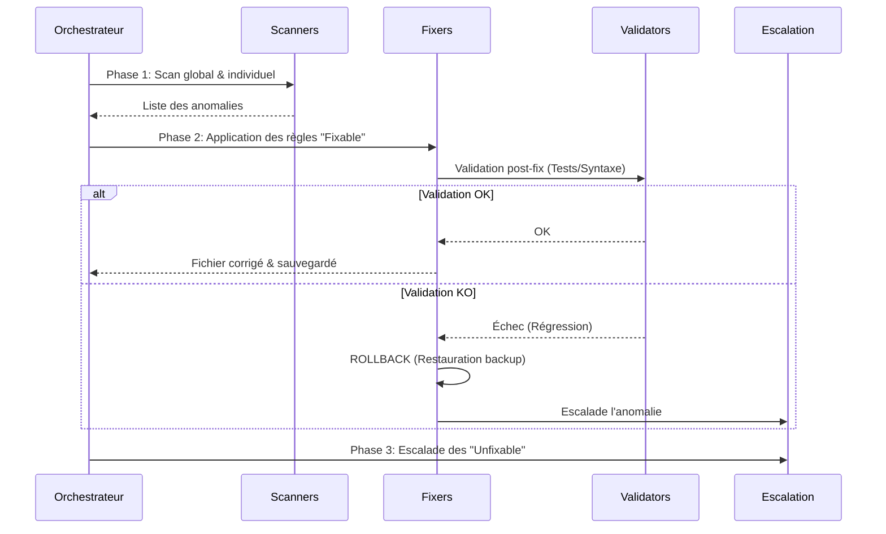

# ELPIS Immune System v3.0

L'Agent d'Audit d'ELPIS est un "Système Immunitaire" autonome (NASA-Grade) conçu pour surveiller, réparer et escalader la dette technique ou les bugs de manière proactive.

## 1. Architecture du Système

Le système est découpé en plusieurs modules (dans le dossier `agent_audit/`) :

1. **`main.py`** : L'orchestrateur. Il coordonne les différentes phases du scan, du reporting et de l'auto-commit.
2. **`engine.py`** : Le moteur de règles. Il charge `rules.json` et détermine la criticité et la faisabilité des corrections.
3. **`scanners.py`** : Les extracteurs. Ils analysent le code source via de multiples stratégies (Regex, Analyse de graphes d'imports, Limites de fichiers/fonctions).
4. **`fixers.py`** : Les correcteurs. Ils appliquent les mutations sur le code (remplacement, suppression de lignes).
5. **`validators.py`** : Les gardiens. Après chaque correction, ils valident la syntaxe et lancent les tests locaux. **S'ils échouent, le Fixer fait un Rollback.**
6. **`escalation.py`** : Le centre de tri. Si une anomalie ne peut pas être corrigée automatiquement (ex: un refactoring de 1000 lignes), elle est "escaladée" dans `escalations.log` pour une intervention humaine.
7. **`health.py`** : L'auto-diagnostic. L'agent vérifie en permanence que ses propres règles sont à jour et utiles.

## 2. Le Cycle de Vie (Audit)



## 3. Comment ajouter une nouvelle règle ?

Toutes les règles sont dans `agent_audit/rules.json`. L'agent lit ce fichier de manière dynamique.
Pour ajouter une règle (ex: bannir l'utilisation de `var`) :

```json
{
  "id": "NO_VAR_KEYWORD",
  "category": "code_quality",
  "severity": "warning",
  "description": "Utilisation de var interdite, utiliser const ou let",
  "detection_strategy": "regex",
  "file_pattern": "\\.(js|jsx)$",
  "pattern": "\\bvar\\s+",
  "fix": {
    "action": "replace_regex",
    "search": "\\bvar\\s+",
    "replacement": "const "
  }
}
```

Si le champ `fix` est défini, l'agent corrigera le code tout seul. S'il vaut `null`, l'agent se contentera d'escalader le problème.
